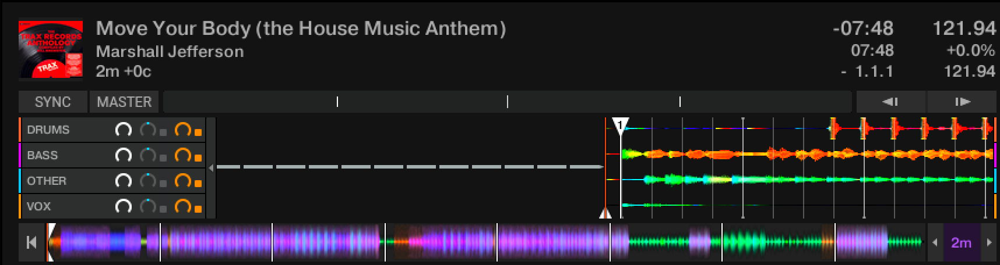

# 🎛 Stemgen

Stemgen is a Stem file generator. Convert any track into a Stem and have fun with Traktor.

A Stem file contains a track split into four musical elements – bass, drums, vocals, and melody, for example. With each element available independently, you have more control over the music you play.

Stemgen uses `spleeter` to separate the 4 stems and `ni-stem` to create the Stem file.

Our new file contains four stems: bass, drums, vocals and other.

## Why?

> "It's no secret that I'm fully behind the approach to encourage individuality in creativity and for artists to play differently. Stems is a new format that mirrors my constant quest for spontaneity to drive the art of performance forwards. I hope that releasing my album From My Mind To Yours in this format, mastered by LANDR, inspires others to support the approach and bring even more flexibility to the art of DJing amongst its most progressive supporters." – Richie Hawtin

Stems are fun but nobody's releasing them. Stemgen is a way to create your own stems with only one command.

## Requirement

- spleeter https://github.com/deezer/spleeter
- ffmpeg https://www.ffmpeg.org (required for spleeter too)
- ni-stem (provided in this repo or available at https://www.stems-music.com/stems-is-for-developers)
- jo https://github.com/jpmens/jo

## Usage

- Clone this repo (downloading instead of cloning loses permissions to execute files)
- `$ ./stemgen -i track.wav`
- Have fun! Your new `.stem.m4a` file is in `output` dir
- Supported input file format are `.wav` `.wave` `.aif` `.aiff` `.flac`

## Performance

- It's working pretty well but we could use other Spleeter models with improved performances.
- You may notice that the output file is pretty big. Apple Lossless Codec (ALAC) for audio encoding is used for lossless audio compression at the cost of increased file size.

## Disclaimer

If you plan to use Stemgen on copyrighted material, make sure you get proper authorization from right owners beforehand.

## License

MIT
